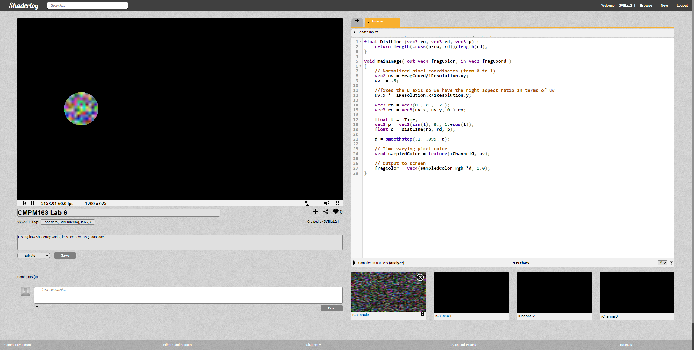

# CMPM163Labs
# Lab 2
[Part 1 Video](https://drive.google.com/open?id=1ZNRToRDp_e3SNvR8d-B4qvdthD6SKX0U)

Part 2

# Lab 3
[Lab 3 Video](https://drive.google.com/open?id=1oTUnCFbzTzYfaUWa9YLIOTEDR36yKESl)

I'll explain the spinning cubes formed in a circle (Red, Yellow, Green, Silver, Turqioise, Purple) and the middle blue one first. What I did was I created each individual cube with its own geometry and material. From there, each cube has its own individual color with a set amount of shininess and flatshading so it reflects not too much from the light.
With the two rectangles in the background, each cube share the same vertex shader but have their own fragmentshader so either cube interpolates its own colors. The toughest part was figuring out which parts I had to disect so I can easily have these two have their own values in the program.
PS If you've played any of the recent 3D Sonic the Hedgehog games, you'd understand what I made in this lab.
# Lab 4
[Lab 4 Video](https://drive.google.com/open?id=1I-rBztRGOa850nWonMzcfIPfjrts3HZ7)

I will be talking about the bottom 3 cubes first. For the left cube, I made a rocky texture with texture 161 including its normal map. For the center cube, I made another rocky texture similar to the left only without a map. The right cube I made out of a lava texture I found on the internet accompanied with texture 164's normal map.

The top 2 cubes are made utilizing a fragment a vertex shader. The left one is a Diamond block from Minecraft while the right is a tiled tnt block from the aformentioned Minecraft. To make the tnt cube tile'd, I doubled vec2 it scales down the tile. From there, I positioned each vec2 by (0,0), (0,1), (1,0), and (1,1) to space the tiles into 4 spots. 

24a. The formula is x = 8u - u

24b. The formula is y = 8 - (8 - 8v)

24c. The color sampled is light grey.
# Lab 5
[Lab 5 Video](https://drive.google.com/open?id=12KbhnCMbFF5P51YR48iQaES8cvABsJjr)

For the particles in his lab, I attached them to player kart. I got help from a tutorial to make flame particles but, halfway through it, I stopped since I wanted a more pixelated fire instead of a real one. I made the particle an 'Edge' shape that the utilized both color and size over lifetime to show the base of the flame expanding.

As for the track, I shifted two track tiles so it connected to the other track to make it longer. From there, I added obstacles and two ramps where you must jump through a donut to continue with the track. I was able to make the checkpoints into donuts by putting the checkpoints inside the donuts and making the donuts large enough so players can drive through them.
# Lab 6

Screenshot to my Shadertoy project: 

Link to my Shadertoy: https://www.shadertoy.com/view/3tXcDn#

Link to a Shadertoy project that looked pretty dang neat: https://www.shadertoy.com/view/wdSfzh

(Warning: lower volume/bass, it gets pretty loud)
