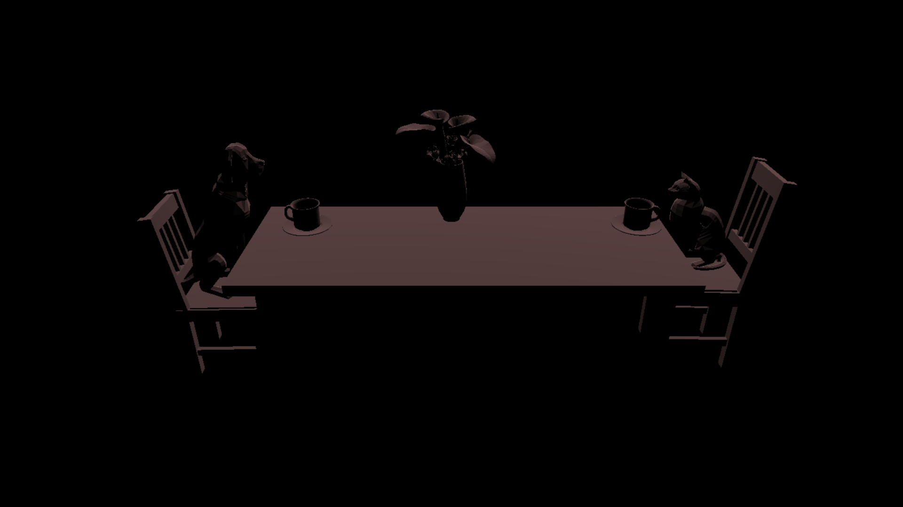

# CMPM163Labs
# Lab 2
[Part 1 Video](https://drive.google.com/open?id=1ZNRToRDp_e3SNvR8d-B4qvdthD6SKX0U)

Part 2

# Lab 3
[Lab 3 Video](https://drive.google.com/open?id=1oTUnCFbzTzYfaUWa9YLIOTEDR36yKESl)

I'll explain the spinning cubes formed in a circle (Red, Yellow, Green, Silver, Turqioise, Purple) and the middle blue one first. What I did was I created each individual cube with its own geometry and material. From there, each cube has its own individual color with a set amount of shininess and flatshading so it reflects not too much from the light.
With the two rectangles in the background, each cube share the same vertex shader but have their own fragmentshader so either cube interpolates its own colors. The toughest part was figuring out which parts I had to disect so I can easily have these two have their own values in the program.
PS If you've played any of the recent 3D Sonic the Hedgehog games, you'd understand what I made in this lab.
# Lab 4
[Lab 4 Video]

24a.

24b.

24c. The color sampled is light grey.
# Lab 5
Part 2a

[Lab 5a Video](https://drive.google.com/open?id=1wN0F1oQ_j38mWtWJcOVcEENxq5vmLe2l)

Part 2b

[Lab 5b Part 1 Video](https://drive.google.com/open?id=1RueDBh1-xFSxVHlbZoG6MmqLV8jsJ9k-)
[Lab 5b Part 2 Video]()
# Lab 6

# Lab 7

# Lab 8
